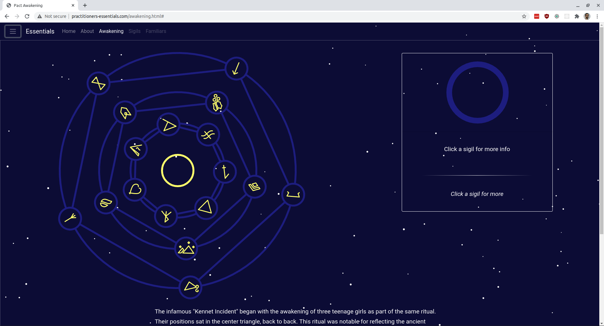

# Practitioner's Awakening!

An online web-app commemorating my favourite ongoing web novel, [Pale](https://palewebserial.wordpress.com/)! 

## Where can I find this?

It's hosted at http://practitioners-essentials.com/awakening.html# 

## What is it?
Its a magic circle representing a similar diagram described in [Pale](https://palewebserial.wordpress.com/), an urban fantasy novel. You can click on the elements/sybmols to see in-fiction notes about each, or click on the characters on the side to see what each character's allignment of symbols is (including some that have no allignment for the middle ring).

I mostly made this as a way to play with non-react web design, since I've never really spent any time doing that.
You can see it hosted live at http://practitioners-essentials.com/awakening.html. It does struggle on mobile due to all the svg transforms, so be warned of that.

## Local installation
after cloning:
```bash
npm install
npm start
```